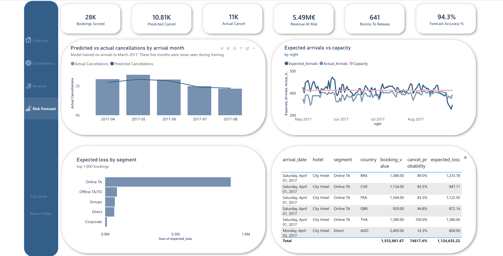

# Hotel Booking Analytics — from lost revenue to a working forecast

Two Portuguese hotels lose **€16.7M** to cancellations against **€26.0M** realised. Only
**60.85%** of booked value is ever earned.

This repository does two things about that, in order.

**Part one** is a Power BI report that measures the problem: where the money goes, which
channels leak it, and what it costs. **Part two** is a machine learning model that predicts
which individual bookings will cancel — and turns that into two decisions a hotel can act on
tonight: how many rooms to oversell, and which guests to call.

The second half exists because the first half found something worth predicting. The report's
strongest finding was that lead time predicts cancellation. The model answers the question
that follows: *by how much, for this booking, and what do I do about it?*



---

## Contents

- [Business context](#business-context)
- [Dataset](#dataset)
- [Part one — measuring the problem](#part-one--measuring-the-problem)
- [Part two — predicting cancellations](#part-two--predicting-cancellations)
- [Part three — decisions](#part-three--decisions)
- [Repository layout](#repository-layout)
- [Running it](#running-it)
- [Limitations](#limitations)
- [Tools and credits](#tools-and-credits)

---

## Business context

Revenue managers do not just need to know *how much* was booked — they need to know how much
of it will actually arrive. A booking that cancels 200 days out is a different asset from one
that cancels the day before, and a channel with high ADR but a 60% cancellation rate may be
worth less than a cheaper, more reliable one.

Every page of the report separates **booked** from **realised**, and quantifies the gap in
euros rather than percentages alone. The model then attaches a probability to each individual
booking, so the gap can be anticipated instead of only measured.

---

## Dataset

**Source:** [Hotel Booking Demand](https://www.kaggle.com/datasets/jessemostipak/hotel-booking-demand) — published on Kaggle by Jesse Mostipak.

**Original research:** Antonio, N., de Almeida, A., & Nunes, L. (2019). *Hotel booking demand
datasets.* **Data in Brief**, 22, 41–49. [ScienceDirect](https://www.sciencedirect.com/science/article/pii/S2352340918315191)

| | |
|---|---|
| Records | 119,390 bookings |
| Period covered | July 2015 – August 2017 |
| Properties | 1 resort hotel (Algarve) and 1 city hotel (Lisbon), both 4-star |
| Granularity | One row per booking |
| Licence | Open — see the Kaggle dataset page for current terms |

Real property-management-system data, anonymised by the original authors. A gzipped copy
(1.1 MB) is committed to `data/`, so the notebooks run without a Kaggle account.

---

# Part one — measuring the problem

## Data model

A lean star schema:

```
Calendar ──┐
           ├── db_hotel_bookings   (fact — one row per booking)
Hotel ─────┤
           ├── nightly_forecast    (model output — one row per hotel-night)
           ├── monthly_accuracy    (model output — predicted vs actual)
           └── call_list           (model output — ranked bookings)

_Measures  (measure-only table, no data)
```

| Table | Role |
|---|---|
| `db_hotel_bookings` | Fact table, plus derived columns for grouping |
| `Calendar` | Date dimension driving every time-based visual |
| `Hotel` | Two-row dimension, added in part two |
| `_Measures` | Every DAX measure, separated from the data |

**Why `Hotel` exists.** The original model had `hotel` as a column on the fact table, which
worked while there was one fact table. Adding three more broke the cross-page slicer: filters
travel from the one side of a relationship to the many side, so slicing a column *on* the fact
table cannot reach the others. A shared dimension fixes it, and the four synced slicers now
point at `Hotel[hotel]`.

**Derived columns** — `Guest Category` (Couple, Single, Family / With Kids, Group of Adults,
Other), `Lead Time Bucket` (0–30, 31–90, 91–180, 180+ days), `Booking Status`, `Guest Type`,
and `Segment Detail Title` for the dynamic drill-through heading.

## Measures

Twenty DAX measures live in a dedicated `_Measures` table, plus six added for the forecast
page.

**Volume** — `Total Bookings`, `Realized Bookings`, `Cancelled Bookings`, `Total Guests`,
`Total Nights Sold`

**Revenue** — `Total Revenue`, `Actual Revenue`, `Lost Revenue`, `Avg ADR`,
`Avg Rev Per Booking`, `Rev Realization %`, `Avg Lost Revenue per Cancel`

**Behaviour** — `Cancellation Rate %`, `No Deposit Cancelled %`, `Avg Lead Time`,
`Avg Lead Time Cancelled`, `Avg Length of Stay`

**Forecast** — `Bookings Scored`, `Predicted Cancellations`, `Actual Cancellations`,
`Revenue At Risk`, `Rooms To Release`, `Forecast Accuracy %`

**How they are layered.** `Total Revenue` is the only measure touching the fact table
directly. `Actual Revenue` and `Lost Revenue` are `CALCULATE` variants of it, so they sum back
to it exactly. Every derived metric references those measures rather than re-deriving from
columns.

That is deliberate. ADR × nights always equals revenue, and realised plus lost always equals
total — in every slice, not just at the grand total. Metrics rebuilt from the fact table each
time drift apart as soon as their filter scopes diverge, usually somewhere no one is looking.

**Revenue-weighted ADR.** `Avg ADR` is deliberately *not* `AVERAGE(adr)`. A column average
treats a one-night booking and a ten-night booking as equal observations. The industry
definition — room revenue ÷ room-nights sold — weights by nights, and that changes the picture
materially at segment level.

## Report pages

### 1. Overview


Revenue, bookings, guests, ADR, lead time and cancellation rate at a glance. Rate seasonality
per hotel, and a scatter plot of lead-time bucket against cancellation rate. A bookmark toggle
switches the left chart between top countries and top market segments.

### 2. Cancellations


The diagnostic page: cancellation volume and rate by market segment, deposit type mix,
lead-time bands split by new versus repeat guests, and a country table ranked by both lost
revenue and cancellation rate.

### 3. Revenue


Realised revenue by month and hotel, ADR by channel, revenue by guest category, and a
hotel → market segment matrix combining revenue, ADR, realised bookings and realisation rate.

### 4. Segment detail (drill-through)


Right-click any segment anywhere in the report to land here. Country mix, monthly trend, and
quarterly bookings split by hotel and guest category, with a dynamic title naming the segment.

### 5. Risk forecast


The model's output, in the units a revenue manager uses: predicted against actual cancellations
by month, expected arrivals against capacity by night, where the exposure sits by channel, and
the ranked confirmation-call list. No accuracy metrics appear on this page — they belong in the
notebooks.

## Key findings

**1. More than one in three bookings never happens.**
44,224 of 119,390 cancelled — **37.04%** — representing **€16.7M** of booking value against
**€26.0M** realised.

**2. Lead time is the strongest single predictor.**
Cancellation rate climbs steadily across lead-time bands. Cancelled bookings average
**144.9 days** of lead time against **104.0 days** overall. Long-horizon bookings are not
secured inventory.

**3. Channel reliability varies far more than channel rate.**
ADR sits in a narrow band across paid channels (roughly €50–€128), but cancellation rate ranges
from **15.3%** (Direct) to **61.1%** (Groups) — a fourfold spread on comparable pricing. Online
TA carries **36.7%** on the largest volume in the business, making it the single biggest source
of absolute exposure.

**4. Direct is the strongest channel on every dimension at once.**
Highest ADR (€128.00 resort, €120.37 city), lowest cancellation rate at 15.3%, highest
realisation among volume channels (82.2% and 78.1%).

This only appeared once ADR was calculated on a revenue-weighted basis. Under a simple column
average, Online TA looked like the higher-rate channel. Weighting by nights reversed the
ranking — the metric definition, not the data, was hiding it.

**5. The two hotels realise booked revenue very differently.**
The resort converts **66.5%** of booked value; the city hotel **56.9%**. The gap concentrates
in the city hotel's Groups business, which realises just **31.4%**.

**6. The domestic market is the concentration risk.**
Portugal is the largest source market at roughly 49K bookings but cancels at **56.6%** — €8.6M
of lost value from one country. The UK (20.2%), Germany (16.7%) and France (18.6%) cancel at
less than half that rate.

**7. Deposits are not doing the work they should.**
**67.1%** of cancellations came from bookings with no deposit attached.

**8. Couples are the commercial core.**
**€17M** of the €26M realised — more than all other guest categories combined.

**9. Demand and rate peak together in summer, differently per hotel.**
The resort is far more seasonal, with ADR spiking above the city hotel in peak months; the city
hotel holds a flatter rate. Two properties, two pricing strategies.

**10. The two properties sell fundamentally different products.**
The resort averages **4.14 nights** against the city hotel's **2.92** — 42% longer. A leisure
business and a business-travel business sharing one P&L.

**Blended ADR** €101.93 · **Average stay** 3.39 nights · **Revenue realisation** 60.85%.

---

# Part two — predicting cancellations

Three notebooks, in order. The interesting work is not the algorithm — it is deciding what the
model is allowed to see, and how to check it without fooling yourself.

## What the model is allowed to see

[`notebooks/01_data_audit.ipynb`](notebooks/01_data_audit.ipynb)

The dataset was assembled after the fact from a property management system. Several columns
describe what happened *after* the booking — sometimes after the guest either arrived or
cancelled. A model trained on those scores beautifully and is worthless in production.

The test used throughout: **a genuine predictor shifts the odds; it does not eliminate them.**
Any column with a value implying a cancellation rate of essentially zero or one is suspect.

| Column | Evidence | Verdict |
|---|---|---|
| `reservation_status` | 100% separation, zero exceptions | dropped |
| `reservation_status_date` | dated after the outcome | dropped |
| `required_car_parking_spaces` | **7,416 bookings requested parking. Not one cancelled.** | dropped |
| `assigned_room_type` | room changed → 5.4% cancel vs 41.6% | dropped |
| `booking_changes` | count only grows after the booking is made | dropped |

The parking column is worth dwelling on. Wanting a parking space cannot make cancellation
impossible; parking is recorded on arrival. Left in, it hands the model a free "definitely not
cancelled" flag for 6% of the data — and it appears in a great many published notebooks on this
dataset.

**Two things kept, with caveats.**

`deposit_type = Non Refund` cancels at **99.4%** (14,494 of 14,587). Read literally that is
absurd: guests who paid non-refundable deposits almost never turned up, while guests who paid
nothing turned up 72% of the time. The likeliest explanation is a recording convention — a
booking charged and never arrived may have been reclassified at cancellation rather than at
sale. Kept, because it is genuinely present at booking time in any real system, but flagged: if
the model's performance rests on this column, it is learning an artefact of this database.

**31,994 rows are exact duplicates** — 26.8% of the data, with no booking identifier to
disambiguate. They cancel at **58.4%** against **26.2%** for unique rows. Two readings are
possible: a tour operator reserving ten identical rooms, or repeated data entry. The Groups
segment cancels at 61.1%, very close to the 58.4% observed, so they are kept as real bookings —
which also keeps every figure reconcilable with the report built on the same 119,390 rows. That
decision drives the next section.

## What the split is worth

[`notebooks/02_modelling.ipynb`](notebooks/02_modelling.ipynb)

Before modelling, one number is worth establishing: how much free AUC does a random train/test
split hand you?

| Split | Logistic regression | Gradient boosting |
|---|---|---|
| **Temporal** (test = arrivals from April 2017) | 0.853 | **0.875** |
| **Random** (same test size) | 0.889 | **0.940** |
| Difference | +0.036 | **+0.065** |

A random split scatters identical rows across train and test, so a model with enough capacity
can store a row during training and be rewarded for recalling it during testing. Splitting on
arrival date prevents that, because identical rows share an arrival date.

Note the asymmetry. Logistic regression cannot memorise individual rows — one coefficient per
feature — so it gains little. **The fabricated gain is largest for the strongest model.** Anyone
comparing model families on a randomly split table of this data would conclude that gradient
boosting is dramatically better, when much of the difference is recall.

The split is drawn at **1 April 2017**: 21 months of arrivals to train on, the final 5 months
held out. The test period cancels at **41.2%** against roughly **35.8%** in training — the
behaviour drifts, and that drift is the central difficulty.

## Ranking is not quantity

"Does it work" has two meanings, and the model is good at one and initially bad at the other.

**Ranking** — is this booking riskier than that one? ROC-AUC **0.87**. Take a cancelled and a
kept booking at random and the model orders them correctly 87% of the time.

**Quantity** — how many of tonight's 200 will cancel? The uncalibrated model predicted **9,220**
cancellations where **11,464** occurred: **−19.6%**, in every single month.

A model can rank perfectly and still say 0.45 where the truth is 0.55 — for everyone. The order
stays right; the numbers are wrong. For a dashboard that says "release 50 rooms", the second
meaning is the one that matters.

**One approach that failed, reported because it failed.** If the recent past predicts the near
future better, weighting recent bookings more heavily during training should help. Half-lives of
270, 365 and 540 days were tried. All landed between −8.0% and −8.7% — indistinguishable from
doing nothing. The reason is instructive: down-weighting old bookings does not tell the model
that cancellations are becoming more frequent, it just gives it less data. The drift is in the
*base rate*, and the base rate is not a feature.

## Rolling recalibration

Calibration maps raw scores onto probabilities that hold up as frequencies. It must be fitted on
data the model never saw, and — the part usually skipped — that data has to sit *between* the
training period and the period being predicted.

The realisation that fixes the rest: **nothing says the calibration has to be fitted once.**

A hotel running this would recalibrate continuously. On 1 June, March through May have completed
— every one of those bookings has a known outcome. Refit the mapping on them and apply it to
June. No future information is used at any point.

| Month | Predicted | Actual | Error |
|---|---|---|---|
| April 2017 | 2,235 | 2,463 | −9.3% |
| May 2017 | 2,456 | 2,762 | −11.1% |
| June 2017 | 2,356 | 2,439 | −3.4% |
| July 2017 | 1,903 | 1,984 | −4.1% |
| **August 2017** | **1,829** | **1,816** | **+0.7%** |

April is 9% low because on 1 April the calibrator has only seen the old, milder level. By August
the error is **under 1%**. The loop learns the new level in roughly three months and then tracks
it.

That is a different kind of claim from "0.87 AUC". It says the system **corrects itself**, and
how long the correction takes — which is what someone deciding whether to trust it with real
inventory actually needs to know.

**Then the aggregate turned out to be hiding a split.** Broken down by hotel, the city hotel was
at +0.8% and the resort at **−24.7%** — worse than doing nothing. One calibration curve, two
properties drifting in different directions, averaged into a total that looked acceptable.
Fitting a separate curve per hotel improved every metric and cut the resort's error to −13.4%.
Still not solved, and stated as such.

## Results

| Approach | ROC-AUC | Brier | Predicted vs actual |
|---|---|---|---|
| Random split *(not used)* | 0.940 | 0.094 | — |
| Temporal split, uncalibrated | 0.868 | 0.159 | **−19.6%** |
| Fixed calibration | 0.868 | 0.146 | −8.3% |
| Recency weighting | 0.867 | 0.147 | −8.2% *(no gain)* |
| Rolling recalibration | 0.866 | 0.147 | −6.0% |
| **Rolling, per hotel** | **0.870** | **0.145** | **−5.6%** |

Ranking barely moves down the table. What changes is whether the numbers can be added up — and
adding them up is what a dashboard does.

Model: `HistGradientBoostingClassifier`, 400 iterations, 31 leaves, isotonic calibration. Chosen
over LightGBM because it ships inside scikit-learn with no `libomp` dependency on macOS, and the
comparison against a logistic baseline showed the evaluation mattered far more than the family.

---

# Part three — decisions

[`notebooks/03_business_output.ipynb`](notebooks/03_business_output.ipynb)

## How large are these hotels?

Neither the dataset nor the source paper states a room count, and without one there is no such
thing as overbooking. It can be recovered: occupancy cannot exceed the number of rooms, so if
the hotels ever sell out, the distribution of nightly occupancy stops at a hard ceiling.

Expanding every realised booking into one row per night of stay, the city hotel spends dozens of
nights between 219 and 226 rooms and never exceeds **226**; the resort clusters around 179–184
and stops at **187**. That is the shape of a constraint, not of demand tapering off.

## How many rooms can be released?

For a given night each booking either arrives or does not, with a different probability each — a
Poisson-binomial distribution, with mean `Σ(1−pᵢ)` and variance `Σ pᵢ(1−pᵢ)`.

The mean matters less than the spread. **The uncertainty is what determines how aggressively a
hotel may oversell**: two nights expecting 200 arrivals are not equally safe if one is built
from confident predictions and the other from coin flips. Across the analysed nights the
standard deviation runs 6–7 rooms.

Management picks a tolerance — how often it will accept being unable to house someone — and the
rule releases up to that quantile.

| Tolerance | Extra room-nights | Revenue | Nights with a walk | Guests affected |
|---|---|---|---|---|
| 1% | 481 | €61,974 | 6 (2.4%) | 126 |
| **5%** | **641** | **€83,442** | **9 (3.7%)** | **164** |
| 10% | 759 | €100,174 | 12 (4.9%) | 191 |
| 20% | 940 | €126,129 | 20 (8.1%) | 242 |

Read the 5% row against its own target: the policy was built to walk a guest on at most 5% of
nights and did so on **3.7%**. The tolerance behaves as specified — the practical proof that the
calibration work was worth doing, since an uncalibrated model would not land near its own stated
risk.

The backtest is deliberately pessimistic: it assumes every released room sells *and* that guest
turns up.

The scale is modest, and that is the honest answer for two hotels already running close to full.
The method matters more than the total — a rule that adapts nightly to how confident the model
is, rather than a fixed percentage applied blindly.

## Which bookings are worth a call?

A confirmation call takes minutes and recovers only a fraction of what it reaches, so it has to
be aimed. Ranking by probability alone sends staff after cheap one-night stays; ranking by value
alone sends them after expensive bookings that were never going to cancel. The quantity worth
ranking on is the product — **expected loss**.

| Calls | Share of bookings | Share of exposure | Actually cancelled |
|---|---|---|---|
| 200 | 0.7% | 6.2% | **82.5%** |
| **1,000** | **3.6%** | **20.5%** | **75.4%** |
| 2,000 | 7.2% | 32.4% | 73.2% |

Against a 41.2% baseline. That is the number to give an operations manager — not an AUC: *call
these thousand, three in four are leaving, and you are covering a fifth of the money at stake.*

Whether a call actually saves a booking, this dataset cannot answer. It would need an experiment:
call a random half of the list, leave the other half, compare.

---

## Repository layout

```
├── README.md
├── data/
│   └── hotel_bookings.csv.gz      source data, gzipped (1.1 MB)
├── notebooks/
│   ├── 01_data_audit.ipynb        leakage, duplicates, the split
│   ├── 02_modelling.ipynb         features, models, calibration
│   └── 03_business_output.ipynb   capacity, overbooking, call list
├── src/
│   └── features.py                feature contract and temporal split
├── outputs/
│   ├── test_predictions.csv       per-booking risk, held-out period
│   ├── nightly_forecast.csv       per hotel-night occupancy and headroom
│   ├── monthly_accuracy.csv       predicted vs actual
│   └── call_list.csv              top 1,000 by expected loss
├── powerbi/
│   ├── Tourism.pbip               project format — model and report as text
│   ├── Tourism.pbix               packaged file, opens without the source data
│   ├── Tourism.SemanticModel/     TMDL — one file per table, DAX in plain text
│   └── Tourism.Report/            PBIR — one JSON per visual
└── images/
```

The report is committed in **PBIP** format as well as `.pbix`. Every measure and every visual is
a text file, so a change to one chart appears in `git diff` as a few lines rather than "binary
file changed".

## Running it

**The notebooks**

```bash
conda create -n hotel-ml python=3.12 -y
conda activate hotel-ml
conda install pandas scikit-learn matplotlib jupyter -y
```

Run `01`, `02`, `03` in order — `03` reads what `02` writes. Total runtime is under a minute on a
laptop. The data is committed, so nothing needs downloading.

**On reproducing the exact figures.** Every number in this README comes from a run on
**Python 3.12, pandas 3.0.1, scikit-learn 1.9.0**. Running on scikit-learn 1.7 moves the
released-rooms total by about 3% and the held-out cancel rate of the call list by roughly one
point — the conclusions are unaffected, but the digits will not match exactly. Worth knowing
before assuming something is broken.

**The report**

Open `powerbi/Tourism.pbix` in Power BI Desktop (free, Windows only). Data is imported, so no
refresh or connection is required. To edit the model as text, open `Tourism.pbip` instead — that
requires the TMDL preview feature enabled.

## Limitations

Stated openly, because they affect how the numbers should be read.

**On the model**

- **The resort remains under-predicted by 13.4%.** Its cancellation rate rose more sharply in
  summer 2017 than six months of prior arrivals could anticipate. Recalibration shortens the lag;
  it does not remove it. Overbooking recommendations for the resort are therefore conservative —
  the model expects more guests than arrive.
- **The first two months after any shift are conservative by design.** April was 9% low.
- **`deposit_type` may be an artefact** of how this database recorded cancellations, not a
  property of hotel guests.
- **The split is on arrival date, not booking date.** A booking made in January for an August
  arrival sits in the test set although it existed before some training bookings. Arrival date is
  right for a question asked per arrival night, but a stricter simulation would split on booking
  date.
- **`arrival_date_year` is deliberately excluded.** It raises test AUC by about 0.017 because the
  model can learn "2017 cancels more", but a model depending on the calendar year cannot be
  applied to a year it has never seen.

**On the decisions**

- **Capacity is inferred**, not given, and the maximum observed is a lower bound. The resort's 187
  rests on a single night; 185 would be a defensible reading.
- **The walk backtest assumes every released room sells** and that guest arrives.
- **Whether a confirmation call saves a booking is untested.**

**On the data**

- **Month-level seasonality is skewed by the collection window.** July and August appear in three
  seasons, January–June in two. Charts aggregating by month name without splitting by year
  overstate the summer peak.
- **Revenue is derived, not billed** — ADR × nights, excluding extras, taxes and any resale of
  cancelled inventory.
- **"Lost revenue" is exposure, not certain loss.** Cancelled inventory can be resold.
- **Currency is assumed to be euros**; the source data does not state it.
- **Known outliers retained** — one booking at ADR 5,400, one negative, an `Undefined` market
  segment. Kept so totals reconcile to the published record count.
- **Two properties, one chain, one country.** These findings describe this chain over this period.
  The method transfers; the numbers do not.

## Tools and credits

Power BI Desktop · Power Query (M) · DAX · Python · pandas · scikit-learn

Dataset by Nuno Antonio, Ana de Almeida and Luis Nunes, published to Kaggle by Jesse Mostipak.
Report, data model, measures, model and analysis built by me.

## Author

**Orestis Androulakis**
[LinkedIn](https://www.linkedin.com/in/orestis-androulakis/) · or.androulakis@icloud.com

If you spot something that could be modelled better, open an issue — I would rather be corrected
than consistent.
