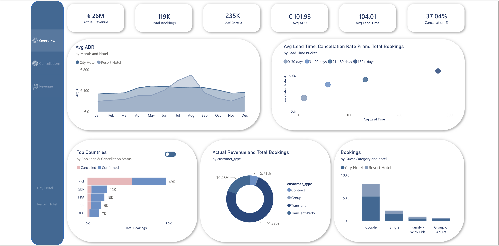
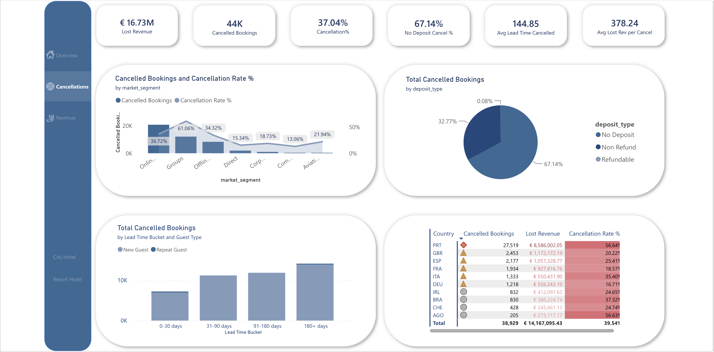
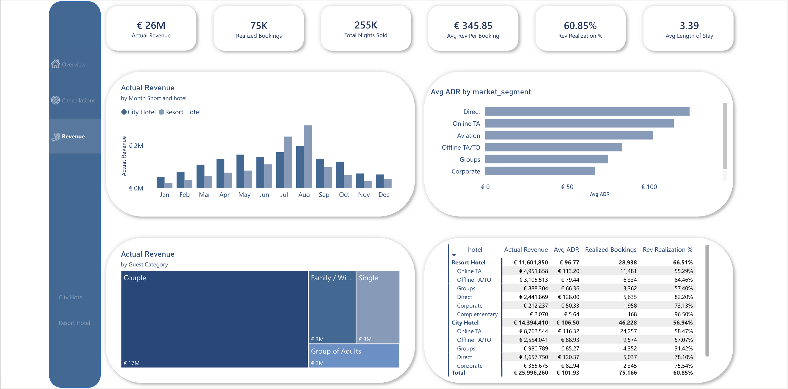
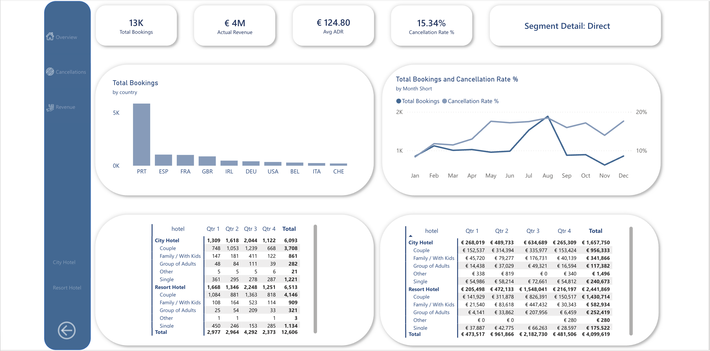

# Hotel Booking Analytics — Power BI Dashboard

An end-to-end Power BI report analysing **119,390 hotel bookings** from two Portuguese hotels, built to answer a single business question: *where is revenue being lost to cancellations, and which segments are worth defending?*

Only **60.85%** of booked value is ever earned. **€16.7M** disappears to cancellations against **€26.0M** realised. In this business, cancellations are not a side issue — they are the business problem.



---

## Table of contents

- [Business context](#business-context)
- [Dataset](#dataset)
- [Data model](#data-model)
- [Measures](#measures)
- [Report pages](#report-pages)
- [Key findings](#key-findings)
- [Assumptions and limitations](#assumptions-and-limitations)
- [How to open](#how-to-open)
- [Tools](#tools)
- [Credits](#credits)

---

## Business context

Revenue managers in hospitality do not just need to know *how much* was booked — they need to know how much of it will actually arrive. A booking that cancels 200 days out is a very different asset from one that cancels the day before, and a channel with high ADR but a 60% cancellation rate may be worth less than a cheaper, more reliable one.

This report is built around that distinction. Every page separates **booked** from **realised**, and quantifies the gap in euros rather than in percentages alone.

**Questions the report answers**

- How much revenue is realised versus lost, by hotel, channel and country?
- Which market segments and source markets cancel most, and what does that cost?
- Does booking lead time predict cancellation risk?
- When is demand and rate strongest across the year, and how do the two hotels differ?
- Who are the highest-value guest types, and are they also the most reliable?

---

## Dataset

**Source:** [Hotel Booking Demand](https://www.kaggle.com/datasets/jessemostipak/hotel-booking-demand) — published on Kaggle by Jesse Mostipak.

**Original research:** Antonio, N., de Almeida, A., & Nunes, L. (2019). *Hotel booking demand datasets.* **Data in Brief**, 22, 41–49. [ScienceDirect](https://www.sciencedirect.com/science/article/pii/S2352340918315191)

| | |
|---|---|
| Records | 119,390 bookings |
| Period covered | July 2015 – August 2017 |
| Properties | 1 resort hotel (Algarve) and 1 city hotel (Lisbon), both 4-star, 200+ rooms |
| Granularity | One row per booking |
| Licence | Open — see the Kaggle dataset page for current terms |

The data is real property-management-system data, anonymised by the original authors. No proprietary or personal information is included.

---

## Data model

The model follows a lean star schema with a dedicated measures table:

```
Calendar (date dimension)
    │
    │ 1 : *
    ▼
db_hotel_bookings (fact — one row per booking)

_Measures (measure-only table, no data)
```

| Table | Role | Notes |
|---|---|---|
| `db_hotel_bookings` | Fact | One row per booking, plus derived columns for grouping |
| `Calendar` | Date dimension | Drives every time-based visual in the report |
| `_Measures` | Measure container | Holds every DAX measure, keeping calculation logic separate from the data |

**Derived columns added during modelling**

| Column | Purpose |
|---|---|
| `Guest Category` | Groups bookings into Couple, Single, Family / With Kids, Group of Adults, Other, from the adults / children / babies fields |
| `Lead Time Bucket` | Bands booking lead time into 0–30, 31–90, 91–180 and 180+ days |
| `Booking Status` | Confirmed vs Cancelled |
| `Guest Type` | New vs Repeat guest |
| `Segment Detail Title` | Dynamic title for the drill-through page, so it names the segment the user came from |

---

## Measures

All 20 measures live in a dedicated `_Measures` table, separate from the data. Seventeen are surfaced on the report; the rest are base measures that other measures build on.

**Volume**

| Measure | Description |
|---|---|
| `Total Bookings` | All bookings, cancelled and confirmed |
| `Realized Bookings` | Bookings that were not cancelled |
| `Cancelled Bookings` | Bookings that were cancelled |
| `Total Cancelled Bookings` | Cancelled bookings, used in the cancellation breakdown visuals |
| `Total Guests` | Adults, children and babies across bookings |
| `Total Nights Sold` | Week and weekend nights on realised bookings |

**Revenue**

| Measure | Definition |
|---|---|
| `Total Revenue` | Base measure — ADR × nights across all bookings, cancelled and confirmed |
| `Actual Revenue` | `Total Revenue` filtered to bookings that were not cancelled |
| `Lost Revenue` | `Total Revenue` filtered to cancelled bookings |
| `Avg ADR` | `Actual Revenue` ÷ `Total Nights Sold` — the revenue-management definition of ADR |
| `Avg Rev Per Booking` | `Actual Revenue` ÷ `Realized Bookings` |
| `Rev Realization %` | `Actual Revenue` ÷ `Total Revenue` |
| `Avg Lost Revenue per Cancel` | `Lost Revenue` ÷ `Cancelled Bookings` |

**A note on how these are layered.** `Total Revenue` is the only measure that touches the fact table directly. `Actual Revenue` and `Lost Revenue` are `CALCULATE` variants of it, so they sum back to it exactly. Every derived metric above then references those measures rather than re-deriving from columns.

That is deliberate. It means ADR × nights always equals revenue, and realised plus lost always equals total — in every slice of the report, not just at the grand total. Metrics built by re-deriving from the fact table each time will drift apart from one another as soon as their filter scopes diverge, usually somewhere no one is looking.

**Revenue-weighted ADR.** `Avg ADR` is deliberately *not* `AVERAGE(adr)`. A plain column average treats a one-night booking and a ten-night booking as equal observations. The industry definition — room revenue divided by room-nights sold — weights by actual nights, which changes the picture materially at segment level.

**Behaviour and risk**

| Measure | Description |
|---|---|
| `Cancellation Rate %` | Cancelled bookings ÷ total bookings |
| `No Deposit Cancelled %` | Share of cancellations that carried no deposit |
| `Avg Lead Time` | Average days between booking and arrival |
| `Avg Lead Time Cancelled` | Average lead time of cancelled bookings |
| `Avg Length of Stay` | Average nights per realised booking |

---

## Report pages

### 1. Overview


Executive summary: revenue, bookings, guests, ADR, lead time and cancellation rate at a glance. Seasonality of rate is shown per hotel, and a scatter plot puts lead-time buckets against cancellation rate to expose the risk relationship. A bookmark toggle switches the left-hand chart between **top countries** and **top market segments** without leaving the page.

### 2. Cancellations



The diagnostic page. Cancellation volume and rate by market segment, deposit type mix, lead-time bands split by new versus repeat guests, and a country table with conditional formatting that ranks source markets by both lost revenue and cancellation rate.

### 3. Revenue



Realised revenue by month and hotel, ADR by channel, a treemap of revenue by guest category, and a hotel → market segment matrix combining revenue, ADR, realised bookings and realisation rate in one table.

### 4. Segment detail (drill-through)



A drill-through page filtered by market segment. Right-click any segment anywhere in the report to land here and see that channel's country mix, monthly booking and cancellation trend, and quarterly bookings and revenue split by hotel and guest category. The page title updates dynamically to name the selected segment, and a back button returns the user to the originating page.

### Report features

- Star-schema model with a dedicated date table
- Drill-through page with a dynamic, context-aware title
- Bookmark-driven toggle between two views of the same visual slot
- Page navigator with a custom icon sidebar, synced across all pages
- Cross-page hotel slicer (City / Resort)
- Conditional formatting and data bars for at-a-glance ranking
- Consistent custom theme throughout

---

## Key findings

**1. More than one in three bookings never happens.**
44,224 of 119,390 bookings were cancelled — a **37.04%** cancellation rate, representing **€16.7M** of booking value against **€26.0M** realised.

**2. Lead time is the strongest single predictor of cancellation.**
Cancellation rate climbs steadily across lead-time bands: bookings made within 30 days of arrival are the most reliable, while those made more than 180 days out are by far the least. Cancelled bookings average **144.9 days** of lead time versus **104.0 days** across all bookings. Long-horizon bookings should not be treated as secured inventory.

**3. Channel reliability varies far more than channel rate.**
Across the paid booking channels ADR sits in a fairly narrow band (roughly €50–€128), but cancellation rate ranges from **15.3%** (Direct) up to **61.1%** (Groups) — a four-fold spread on broadly comparable pricing. Online TA carries a **36.7%** cancellation rate on the largest booking volume in the business, making it the single biggest source of absolute exposure.

**4. Direct is the strongest channel on every dimension at once.**
Direct achieves the **highest ADR** of any channel (€128.00 at the resort, €120.37 at the city hotel), the **lowest cancellation rate** at 15.3%, and the **highest revenue realisation** among volume channels (82.2% and 78.1%). Online TA books more, but converts €113–116 ADR at a 36.7% cancellation rate and realises only 55–58% of what it books.

This finding only appeared once ADR was calculated on a revenue-weighted basis. Under a simple column average, Online TA looked like the higher-rate channel. Weighting by nights reversed the ranking — the metric definition, not the data, was hiding it.

**5. The two hotels realise booked revenue very differently.**
The resort converts **66.5%** of booked value into revenue; the city hotel only **56.9%**. The gap concentrates in the city hotel's Groups business, which realises just **31.4%** — under a third of what it books.

**6. The domestic market is the concentration risk.**
Portugal is the largest source market at roughly 49K bookings, but cancels at **56.6%** — €8.6M of lost value from a single country. By contrast the UK (20.2%), Germany (16.7%) and France (18.6%) cancel at less than half that rate. Volume and value are not the same thing here.

**7. Deposits are not doing the work they should.**
**67.1%** of all cancellations came from bookings with no deposit attached, confirming that the no-deposit policy carries the bulk of cancellation exposure.

**8. Couples are the commercial core.**
Couples generate **€17M** of the €26M realised — more than all other guest categories combined. Family, single and group bookings each contribute €2–3M.

**9. Demand and rate peak together in summer, but the two hotels behave differently.**
Revenue concentrates in July and August. The resort hotel is far more seasonal, with ADR spiking sharply above the city hotel in peak months, while the city hotel holds a flatter, more stable rate across the year — two properties requiring two different pricing strategies. *(See the note on seasonality below.)*

**10. The two properties sell fundamentally different products.**
The resort averages **4.14 nights** per booking against the city hotel's **2.92** — stays 42% longer. Combined with the resort's sharper summer rate spike, this is a leisure business and a business-travel business sharing one P&L, and they should not be managed with one strategy.

**Blended ADR:** €101.93 (City €106.50, Resort €96.77). **Average length of stay:** 3.39 nights. **Revenue realisation:** 60.85% — just under 61 cents of every euro booked is actually earned.

---

## Assumptions and limitations

Stated openly, because they affect how the numbers should be read.

- **Month-level seasonality is skewed by the collection window.** The data runs July 2015 – August 2017, so July and August appear in three seasons while January–June appear in two. Charts that aggregate by month name without splitting by year therefore overstate the summer peak. The direction of the finding holds; the magnitude should be read with care.
- **Revenue is derived, not billed.** `Actual Revenue` is calculated as average daily rate × nights stayed. It excludes extras, taxes, no-show recovery and any resale of cancelled inventory.
- **"Lost revenue" is potential, not certain loss.** Cancelled inventory can be resold, particularly at short lead times. The figure measures exposure, not net loss.
- **Currency.** The source data does not state a currency. Euros are used throughout on the basis that both properties are located in Portugal.
- **Known outliers in the source data.** The raw dataset contains extreme ADR values, including one booking at 5,400 and one negative rate. An `Undefined` market segment is also present and has been retained rather than silently dropped, so totals reconcile to the published record count.
- **Two properties, one chain, one country.** Findings describe this chain over this period and should not be generalised to the wider hospitality market.

---

## How to open

1. Install [Power BI Desktop](https://powerbi.microsoft.com/desktop/) (free, Windows only).
2. Download `Tourism.pbix` from this repository.
3. Open the file. The data is imported, so no data source connection or refresh is required.

---

## Tools

Power BI Desktop · Power Query (M) · DAX · Star-schema data modelling

---

## Credits

Dataset by Nuno Antonio, Ana de Almeida and Luis Nunes, published to Kaggle by Jesse Mostipak. Report, data model and measures built by me.

---

## Author

**Orestis [SURNAME]**
[LinkedIn](https://www.linkedin.com/in/YOUR-HANDLE) · orestis.androul@gmail.com

If you spot something that could be modelled better, open an issue — I would rather be corrected than consistent.
